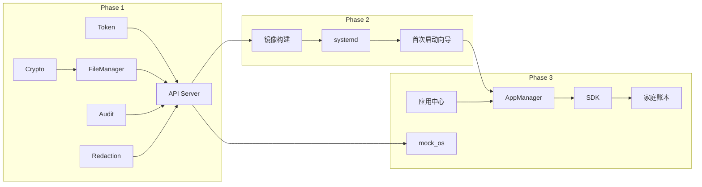

# wowOS 项目可行性评估（完整版）

## 结论：**项目可行**

在文档所描述范围内，wowOS 在技术栈、架构设计和实现路径上均可落地，适合作为中小型项目或小团队在 3–6 个月内做出可演示版本。以下分维度说明依据，并指出需补齐或修正的点。

---

## 1. 技术栈与依赖

- **语言与框架**：Python 3.9+、Flask、JWT、SQLite、cryptography、PyYAML、requests 等均为成熟技术，无冷门或实验性依赖。
- **目标平台**：基于 Raspberry Pi OS Lite 构建镜像、chroot 定制、systemd 服务是常见做法，资料多、可复制性强。
- **应用侧**：简陋版应用中心用“静态 `apps.json` + HTTP 静态文件服务”即可，无需复杂后端，与文档定位一致。

**结论**：技术栈可行，无不可逾越的依赖或平台障碍。

---

## 2. 架构与文档质量

文档已给出较清晰的层次和模块划分；数据流（请求 → Token 校验 → 文件/脱敏/审计 → 加密存储）逻辑自洽；README 中各模块均有示例或伪代码，可作为实现蓝本。**结论**：架构完整、文档足以支撑实现，可行性高。

---

## 3. 各模块实现难度与缺口

| 模块         | 难度  | 说明                                                                                                                  |
| ---------- | --- | ------------------------------------------------------------------------------------------------------------------- |
| Token 授权服务 | 低   | 示例完整；需补：撤销列表持久化、SECRET_KEY 从配置/HSM 派生。                                                                              |
| 文件管理抽象层    | 低   | 示例可直接扩展；注意 `store_file` 中 `time` 需 `import time`。                                                                   |
| 加密存储引擎     | 中   | 算法与流程明确；**需修正**：示例中 `encrypt_file` 未把 nonce 写入 `encrypted_data`，解密端假设 nonce 在数据前，需统一格式（如 12 字节 nonce + ciphertext）。 |
| 脱敏引擎       | 中高  | 文本正则示例已有；图片（如人脸模糊）仅提及未实现，可先做“按级别拒绝访问”或占位，后续再补。                                                                      |
| 审计日志       | 低   | SQLite 表结构与写入示例足够，易落地。                                                                                              |
| 系统服务 API   | 低   | Flask 路由与 Token 校验流程清晰；需从 Token 解析并写入 `user_id`/`app_id` 到审计。                                                       |
| 镜像构建与烧录    | 中   | `build_image.sh` 流程合理；需在非 root 或 CI 中处理 `losetup`/mount 权限与路径。                                                      |
| 应用商店（客户端）  | 中   | 安装/更新/卸载逻辑完整；**缺口**：未说明如何为每个应用生成并注册 systemd unit，需在 `app_manager` 中补。                                               |
| 应用中心（服务端）  | 低   | 静态目录 + `generate_index.py` 即可；建议从包内 `manifest.json` 读取并生成 `apps.json`。                                              |
| SDK + 家庭账本 | 低   | 接口与调用方式明确；示例中 `DB_PATH` 与“数据在 OS 层”的表述需统一。                                                                          |

---

## 4. 主要风险与缓解

**（已补充至 README §4）** 产品技术文档中已包含：安全风险（密钥泄露、Token 伪造、存储权限、中间人、撤销列表）、脱敏风险、应用生命周期风险、开发与部署风险及对应缓解措施表格。

- **安全**：SECRET_KEY、device_key 需从配置/HSM 派生，密钥不入库，Token 存贮权限控制。
- **脱敏**：V1 仅做文本 + 按级别限制访问，图像脱敏作为后续迭代。
- **应用生命周期**：**已补充至 README §5.1–5.3** systemd unit 模板、Nginx/Caddy 反向代理配置及应用安装时动态生成 unit/反向代理的说明。
- **开发体验**：**已补充至 README §5.4** mock_os 接口约定、启动方式、API 与 SDK mock 模式、权限与脱敏模拟及使用示例。

---

## 5. 实施建议（优先级）

1. **Phase 1（核心可用）**：数据主权内核（Token + 文件管理 + 加密 + 审计）+ 系统服务 API，修正加密格式与审计中的 user_id/app_id；可先用 PBKDF2 + device_id 派生密钥。
2. **Phase 2（可交付镜像）**：镜像构建脚本、systemd 服务、首次启动向导，确保树莓派上能跑通 API 与基础文件读写。
3. **Phase 3（应用生态）**：应用管理服务（含 systemd unit 生成）、应用中心（从 manifest 生成 apps.json）、SDK 与家庭账本示例、反向代理与 mock_os 说明。

---

## 6. 资源与工期粗估（补全）

- **人力**：1 名全栈/后端开发可独立完成 MVP；若有 1 人负责应用/前端，可并行应用商店与示例应用，缩短总周期。
- **工期**：Phase 1 约 4–6 周，Phase 2 约 2–3 周，Phase 3 约 3–4 周；整体 3–6 个月可交付可演示版本（含一台树莓派验证）。
- **环境**：开发阶段 Linux/macOS + Python 虚拟环境即可；镜像构建需 Linux 环境（或 CI 中 Docker/VM）；真机验证需至少一块树莓派与 SD 卡。

**结论**：资源需求在中小团队可承受范围内，工期可行。

---

## 7. 不可行条件与前置假设（补全）

在以下情况下，当前方案需重新评估或收缩范围：

- **不可行或需暂停**：若必须首版就支持 TPM/SE 且目标设备无相应硬件或驱动，则密钥方案需改为纯软件（PBKDF2）并接受安全假设降级；若要求首版支持通用图像/视频脱敏且无现成库可用，则应将该能力移出 MVP。
- **前置假设**：默认使用 Raspberry Pi OS 系镜像，且内网部署（应用中心、设备管理不依赖公网）；默认“简陋版”应用商店不要求签名、沙箱，仅做下载/安装/更新/卸载；默认管理员具备基本 Linux 运维能力（烧录、systemd、反向代理配置）。

**结论**：在文档与上述假设下，无可判定为不可行的硬性条件。

---

## 8. 依赖与关键路径（补全）

- **关键路径**：Token/FileManager/Crypto/Audit → API Server → 镜像构建 → systemd/首次启动 → AppManager → SDK/示例应用。脱敏引擎可与 Phase 1 并行，但 API 依赖其接口。
- **可并行**：应用中心（服务端）与 AppManager（客户端）可并行；SDK 与家庭账本可与应用中心并行；mock_os 可与 API 开发并行（约定接口后）。

---

## 9. 测试与验证可行性（补全）

- **单元/集成**：Token 签发与校验、文件读写与加密解密、审计写入与查询、脱敏规则（文本）均可通过 pytest + 临时目录/内存 SQLite 验证，无不可测点。
- **安全与合规**：密钥不落盘、Token 过期与撤销、按级别访问与脱敏结果可做自动化断言；若后续需合规审计，当前审计日志格式可扩展，无需推翻设计。
- **端到端**：在树莓派或等价 ARM 设备上烧录镜像后，通过 REST 客户端上传/下载文件、检查审计表与脱敏结果，即可验证端到端可行性。

**结论**：测试与验证手段明确，可行性无碍。

---

## 10. 运维与部署可行性（补全）

- **部署**：单机内网部署，依赖少（HTTP 服务、SQLite、本地文件系统），无分布式组件，运维复杂度低。
- **升级**：系统升级可通过新镜像替换或 apt/脚本更新 wowOS 核心代码并重启服务；应用通过应用商店更新，数据在 OS 层保留。
- **备份与恢复**：关键数据为 `/data`（含 files、metadata.db）与 `/var/lib/wowos`（audit、apps、token 撤销列表等），可脚本化备份与恢复，无特殊约束。

**结论**：运维与部署在文档设定范围内可行。

---

## 评估总结

| 维度       | 结论             |
| -------- | -------------- |
| 技术栈与依赖   | 可行             |
| 架构与文档    | 可行             |
| 各模块实现难度  | 可行，有明确缺口与修正点   |
| 风险与缓解    | 可控             |
| 资源与工期    | 3–6 个月可交付可演示版本 |
| 不可行条件与假设 | 无硬性不可行条件       |
| 依赖与关键路径  | 清晰，可并行处明确      |
| 测试与验证    | 可测、可验证         |
| 运维与部署    | 可行             |

**最终结论**：wowOS 项目在 README 与上述假设下**可行**；建议按 Phase 1 → 2 → 3 推进。README 已补充主要风险与缓解（§4）、部署与开发指南（§5：systemd unit 模板、反向代理、mock_os 约定）；实现时优先补齐加密格式、审计 user_id/app_id、在 app_manager 中实现 systemd unit 生成、应用中心从 manifest 生成 apps.json。